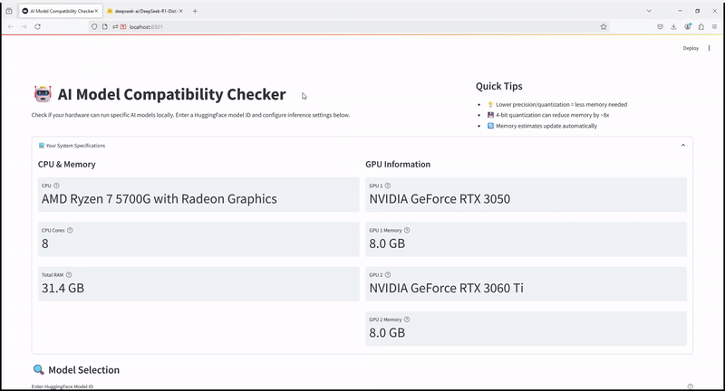

# AI Model Compatibility Checker

A tool to check if your local system can run specific AI models by analyzing your hardware specifications and comparing them with model requirements.

## 🎥 Demo



## ⚠️ Important Note

This tool is designed to run **locally only** and cannot be deployed on Streamlit Cloud or similar platforms because it needs direct access to your system's hardware information (CPU, GPU, RAM).

## 🚀 Quick Start

1. Clone the repository:
   ```bash
   git clone https://github.com/YOUR_USERNAME/ai-model-compatibility-checker.git
   cd ai-model-compatibility-checker
   ```

2. Create and activate a Python virtual environment:
   ```bash
   python -m venv venv
   # On Windows:
   .\venv\Scripts\activate
   # On Unix/MacOS:
   source venv/bin/activate
   ```

3. Install dependencies:
   ```bash
   pip install -r requirements.txt
   ```

4. Create a `.env` file in the root directory and add your Anthropic API key:
   ```
   ANTHROPIC_API_KEY=your-api-key-here
   ```

5. Run the application:
   ```bash
   cd app
   streamlit run main.py
   ```

## 🔧 Features

- 📊 Real-time system specifications detection (CPU, RAM, GPU)
- 🤖 HuggingFace model requirements analysis
- 💾 Memory estimation for different precision and quantization settings
- 🎯 Compatibility scoring and recommendations
- 🔄 Automatic memory requirement adjustments based on inference settings

## 🛠️ System Requirements

- Python 3.8 or higher
- NVIDIA GPU (optional, for GPU compatibility checks)
- Windows/Linux/MacOS
- Internet connection (for fetching model information)

## 📝 Development

1. Fork the repository
2. Create a feature branch
3. Make your changes
4. Submit a pull request

## 🤝 Contributing

Contributions are welcome! Please feel free to submit a Pull Request.

## 📄 License

This project is licensed under the MIT License - see the LICENSE file for details. 
